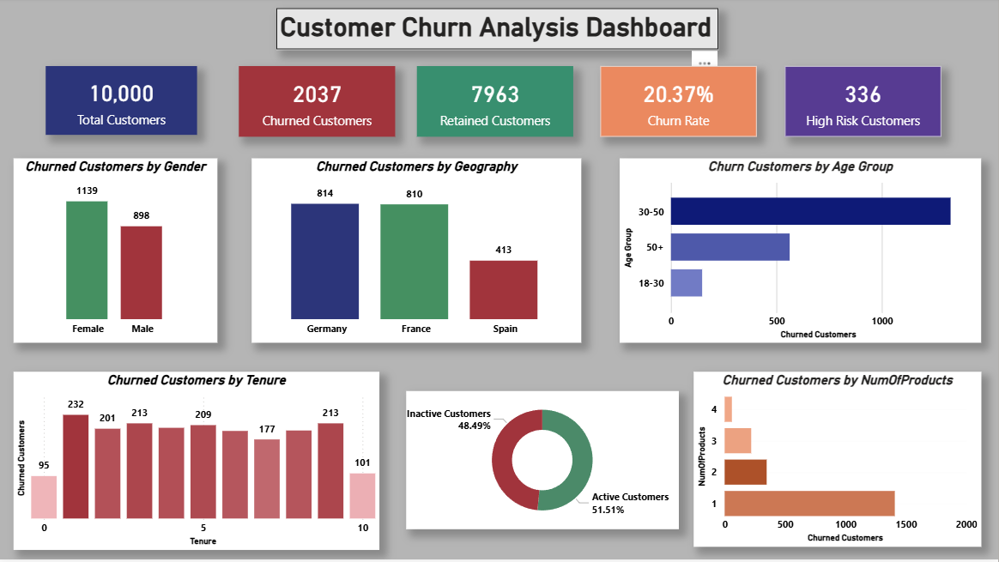
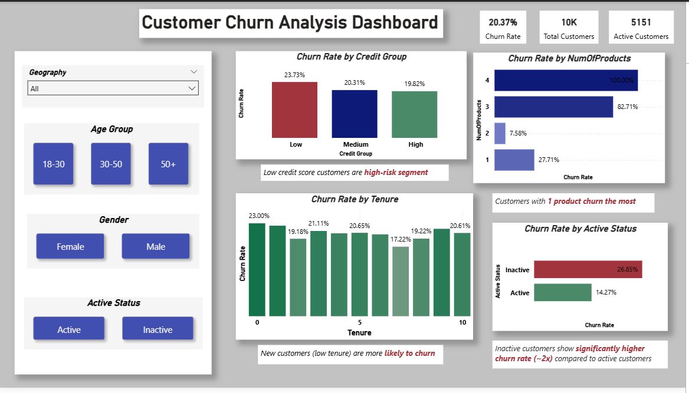
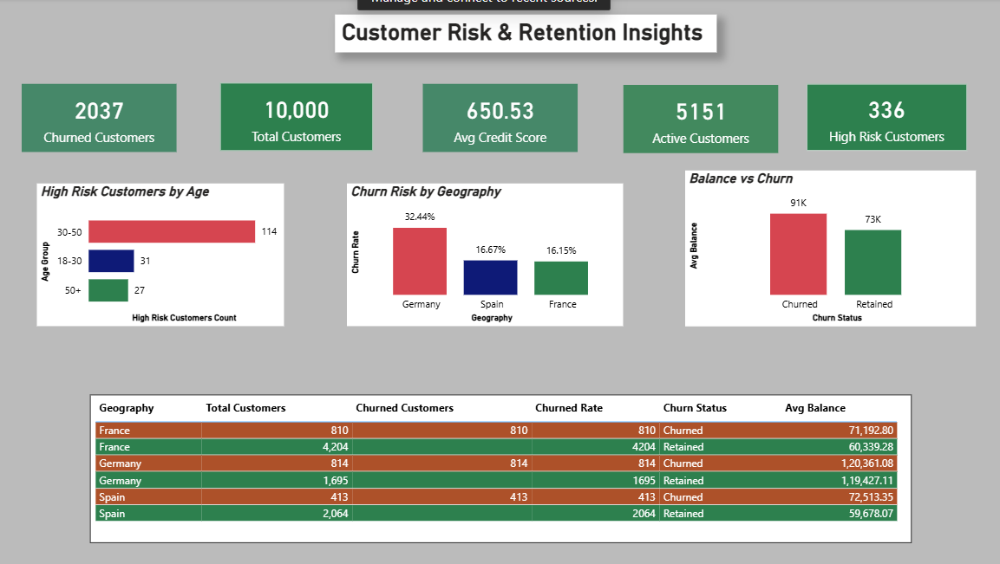

# 📊 Customer Churn Analysis Dashboard

This project analyzes customer churn behavior and identifies high-risk segments using Power BI.
The goal is to understand why customers leave and provide actionable insights to improve retention.

---

## 🎯 Objective

* Identify key factors driving customer churn
* Segment high-risk customers
* Provide data-driven recommendations for retention

---

## 📂 Dataset

* Customer demographic data
* Account details (balance, tenure, products)
* Credit score and activity status

---

## 📊 Dashboard Features

* Churn analysis by geography, age, and gender
* Credit score and product-based churn insights
* Customer activity and tenure impact
* High-risk customer identification

---

## 🔥 Key Insights

* Churn rate is **20.37%**, meaning 1 in 5 customers leave
* Germany has the **highest churn rate (~32%)**
* Customers with **low credit scores are high-risk**
* Single-product users churn the most
* Inactive customers have **2x higher churn rate**
* High-balance customers leaving → **revenue loss risk**

---

## 💡 Business Recommendations

* Focus retention strategies on **Germany region**
* Improve onboarding for **new customers (low tenure)**
* Encourage **multi-product adoption**
* Re-engage **inactive customers**
* Target **low credit score segments** with personalized offers

---

## 🛠 Tools Used

* Power BI
* Excel

---

## 📸 Dashboard Preview

(# 📊 Customer Churn Analysis Dashboard

This project analyzes customer churn behavior and identifies high-risk segments using Power BI.
The goal is to understand why customers leave and provide actionable insights to improve retention.

---

## 🎯 Objective

* Identify key factors driving customer churn
* Segment high-risk customers
* Provide data-driven recommendations for retention

---

## 📂 Dataset

* Customer demographic data
* Account details (balance, tenure, products)
* Credit score and activity status

---

## 📊 Dashboard Features

* Churn analysis by geography, age, and gender
* Credit score and product-based churn insights
* Customer activity and tenure impact
* High-risk customer identification

---

## 🔥 Key Insights

* Churn rate is **20.37%**, meaning 1 in 5 customers leave
* Germany has the **highest churn rate (~32%)**
* Customers with **low credit scores are high-risk**
* Single-product users churn the most
* Inactive customers have **2x higher churn rate**
* High-balance customers leaving → **revenue loss risk**

---

## 💡 Business Recommendations

* Focus retention strategies on **Germany region**
* Improve onboarding for **new customers (low tenure)**
* Encourage **multi-product adoption**
* Re-engage **inactive customers**
* Target **low credit score segments** with personalized offers

---

## 🛠 Tools Used

* Power BI
* Excel

---

## 📸 Dashboard Preview

(# 📊 Customer Churn Analysis Dashboard

This project analyzes customer churn behavior and identifies high-risk segments using Power BI.
The goal is to understand why customers leave and provide actionable insights to improve retention.

---

## 🎯 Objective

* Identify key factors driving customer churn
* Segment high-risk customers
* Provide data-driven recommendations for retention

---

## 📂 Dataset

* Customer demographic data
* Account details (balance, tenure, products)
* Credit score and activity status

---

## 📊 Dashboard Features

* Churn analysis by geography, age, and gender
* Credit score and product-based churn insights
* Customer activity and tenure impact
* High-risk customer identification

---

## 🔥 Key Insights

* Churn rate is **20.37%**, meaning 1 in 5 customers leave
* Germany has the **highest churn rate (~32%)**
* Customers with **low credit scores are high-risk**
* Single-product users churn the most
* Inactive customers have **2x higher churn rate**
* High-balance customers leaving → **revenue loss risk**

---

## 💡 Business Recommendations

* Focus retention strategies on **Germany region**
* Improve onboarding for **new customers (low tenure)**
* Encourage **multi-product adoption**
* Re-engage **inactive customers**
* Target **low credit score segments** with personalized offers

---

## 🛠 Tools Used

* Power BI
* Excel

---

## 📸 Dashboard Preview

---

## 📁 Files Included

* Power BI file (.pbix)
* Dataset
* Dashboard screenshots
)

---

## 📁 Files Included

* Power BI file (.pbix)
* Dataset
* Dashboard screenshots
)

---

## 📁 Files Included

* Power BI file (.pbix)
* Dataset
* Dashboard screenshots

